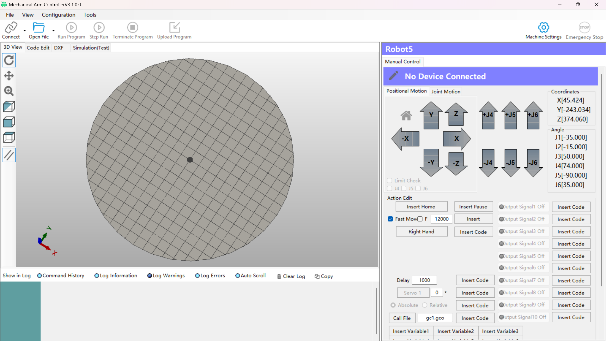

# Hoàng Kim Vĩnh

**Embedded Firmware Engineer** · Industrial IoT · Edge AI

`STM32H7` `CAN / FDCAN` `MISRA C:2012` `State Machines` `ESP32 / ESP-IDF` `MQTT` `Edge AI on MCU`

---

## 👋 About Me

I'm a **4th-year Information Technology student at Hanoi University of Science and Technology (HUST), Vietnam**, with hands-on experience writing **production embedded firmware** — not just hobby projects.

Most of my firmware work happens at **APES Lab**, where I contribute to a **commercial DC fast-charging station** developed with a partner manufacturer. The codebase is under NDA, so the code stays private — but the technical scope is what I do every day:

- **Power-sharing firmware for a ring-topology EV charging network** (`STM32H723`, CAN 2.0B 29-bit over SPI-to-CAN MCP2515, up to 32 charging guns across 16 cabinets)
- **Distributed power borrowing / reclaim algorithms** — when one EV needs more power than one power module, the firmware autonomously borrows capacity from idle guns and reclaims it later
- **Layered architecture discipline**: `App → Middleware (Service / FSM / Control) → Driver → HAL`, with strictly enforced upward-only call rules
- **MISRA C:2012 static analysis** pipeline (cppcheck + custom addon) and **PC-based unit tests** with mocked HAL
- **Non-blocking firmware design** — no `HAL_Delay()` anywhere; all timing via a 1 ms software timer array
- **Multi-gun DC charger firmware** — OCPP, GB/T 27930 vehicle-side comms, DLT-645 DC metering, WIZnet Ethernet controllers, RFID, insulation monitoring (IMD), USB Host + FATFS, bootloader / IAP

Alongside that, I build **complete IoT products end-to-end** — PCB design, firmware, backend, and mobile app — mostly as university capstone and scholarship projects.

My AI background is formal, not just self-taught: a **Machine Learning Specialization (DeepLearning.AI × Stanford)** and a **Deep Learning Specialization (DeepLearning.AI)**, five courses in total. That foundation is what lets me run models on-device — YOLOv11n for vehicle damage assessment, and a Vietnamese voice-command classifier running entirely on an ESP32-P4 with no cloud dependency.

**Currently targeting full-time Embedded / IoT roles**, ideally in Japan. I hold a **JLPT N3** certification, so I can work in Japanese.

---

## 🛠️ Technical Stack

### Firmware & Embedded

### Protocols & Connectivity

### Embedded GUI & Edge AI

### Backend, App & Tools

---

## 📜 Certifications

**Machine Learning Specialization** — DeepLearning.AI × Stanford University

| Course | Issued | Credential |
|---|---|---|
| Supervised ML: Regression & Classification | Apr 2025 | [verify](https://www.coursera.org/verify/M47TFJODCUNI) |
| Advanced Learning Algorithms | Apr 2025 | [verify](https://www.coursera.org/verify/2VXVI89JR95T) |
| Unsupervised Learning, Recommender Systems & Reinforcement Learning | May 2025 | [verify](https://www.coursera.org/verify/MAEJCBE6MVSF) |
| Machine Learning Capstone | May 2025 | [verify](https://www.coursera.org/verify/UHT9B8ZDAYAU) |

**Deep Learning Specialization** — DeepLearning.AI

| Course | Issued | Credential |
|---|---|---|
| Neural Networks and Deep Learning | Jul 2025 | [verify](https://www.coursera.org/verify/XEGM5HWY79T5) |

**Language** — **JLPT N3**, Japanese Language Proficiency Test ([jlpt.jp](https://www.jlpt.jp/))

---

## ⭐ Featured Projects

### 🏠 [SmartHome](https://github.com/CatKod/SmartHome) — STM32H7 + ESP32-S3 Smart Home System

**A two-tier architecture where a real-time MCU never depends on the cloud to stay safe.**

| | |
|---|---|
| **Edge controller** | STM32H7 (STM32CubeIDE) + TouchGFX GUI |
| **Connectivity** | ESP32-S3 running ESP-IDF, linked over a documented UART protocol |
| **Cloud** | MQTT broker + web dashboard |
| **Hardware** | RFID RC522, SG90 servo door lock, PIR, DHT11, LDR, NTC, rain sensor, 74HC595 shift-register LED bar |

The core design principle: **MQTT and the web dashboard can never drive the hardware directly.** Every command is validated by the STM32H7 before any actuator moves — the cloud is a convenience, not a dependency.

> 📌 University capstone project — team of 4. **Graded 10/10.**

 

### 🔌 [Smart_Power_Outlet](https://github.com/CatKod/Smart_Power_Outlet) — PCB → Firmware → App, Full-Stack

A complete IoT product built from the ground up, covering every layer:

- **Hardware** — custom PCB designed in **EasyEDA Pro** (schematic + layout)
- **Firmware** — ESP32 in **ESP-IDF (C)** with **Wi-Fi provisioning** (SoftAP-based, no hardcoded credentials), plus a **PlatformIO** build targeting both ESP32 and ESP8266
- **App** — cross-platform **Flutter** mobile application

> 📌 **My graduation capstone project** (đồ án tốt nghiệp) — solo, full scope from PCB to app.

 

### 🤖 [Sun-Car-Damage-AI-Assessment](https://github.com/CatKod/Sun-Car-Damage-AI-Assessment) — Edge AI for Industrial Inspection

**YOLOv11n vision running on a server, streaming detections to microcontrollers in real time.**

- **Model** — YOLOv11n (Ultralytics) for object detection + instance segmentation + severity estimation
- **Edge bridge** — **ESP32-CAM** captures frames and streams detections to an **STM32** over UART
- **Interfaces** — Flask inference server, Streamlit demo, PC-side STM32 toolchain

> 🏅 Built to apply for the **SUN Excellence Scholarship** — passed the project review round.

 

### 🔧 More Embedded & IoT Work

| Project | What it shows |
|---|---|
| [`Yootek-IOT-intern`](https://github.com/CatKod/Yootek-IOT-intern) | **Enterprise IoT internship** — SmartGarden: ESP32/ESP-IDF firmware + NestJS + PostgreSQL + Prisma + MQTT + WebSocket + JWT/RBAC |
| [`AIoT-Face_And_Order`](https://github.com/CatKod/AIoT-Face_And_Order) | ESP32-CAM → HTTP → OpenCV face detection pipeline |
| [`Attendance_Check`](https://github.com/CatKod/Attendance_Check) | Production system at APES Lab — Next.js admin + Electron kiosk + Expo + Supabase |
| [`SmartSlide_JP`](https://github.com/CatKod/SmartSlide_JP) | Smart projector control system |

---

## 🏭 Industrial Firmware (NDA — code not public)

I'm not able to publish this code, but it's the largest part of my experience and the part I'm proudest of.

**DC Fast-Charging Station — Link Firmware** · `STM32H723` · CAN 2.0B · MISRA C:2012

- Designed a **4-layer architecture** (`App → Middleware → Driver → HAL`) where drivers contain no state machines and know nothing about the protocol above them
- Authored the **SPI-to-CAN driver stack** (MCP2515), including bit-timing calculation for 125 kbps, ISR-level frame buffering, and **bus-off self-recovery**
- Implemented the **CAN frame codec** (29-bit ID, 6 fields, 5 message types) with explicit shift/mask field definitions
- Built **distributed power-sharing algorithms** — ring-topology traversal by modulo, two-direction idle-gun discovery, event-priority reclamation, and safe contactor sequencing (ramp current to zero *before* opening a contactor)
- Designed the **station state machine**: `INIT → DISCOVERY → RUN → SAFE`, fully non-blocking
- Enforced a **single-writer ownership rule** per shared variable to eliminate data races
- Built the quality pipeline: `cppcheck` + MISRA addon, Unity unit tests with a mocked HAL running on PC, fault injection (stuck contactor, unplugged CAN, current sensor failure), and logic-analyser bench verification

**Two-gun DC charger firmware** · STM32 · OCPP · GB/T 27930 · DLT-645

- Device drivers for **7 WIZnet Ethernet controllers** (W5100 / W5100S / W5200 / W5300 / W5500 / W6100 / W6300)
- **OCPP** charge-point management, **GB/T 27930** vehicle-side comms, **DLT-645** DC energy metering
- **Bootloader / IAP** over USB and Ethernet, **USB Host** with **FATFS** log export, RFID, insulation monitoring (IMD), PT1000 thermal measurement

🖼️ 6-axis robotic arm control (third-party platform)

The control software for a 6-axis industrial arm is provided by the manufacturer, so the software itself isn't mine — **but I write the motion control programs** that drive all six axes, in the vendor's control language (PLC-style logic), on top of an OpenCV template-matching vision pipeline with an industrial GigE camera.

 

---

## 🌱 Leadership

Since my first year at HUST, I've led or co-led **every team project I've been part of** — planning the work, splitting tasks, and shipping the result. That includes the SmartHome capstone (10/10) and my graduation capstone, which I delivered solo across hardware, firmware, and app.

I also maintain a personal **hardware notebook** — schematics, pinouts, datasheets, and wiring guides for every board I've worked with — because I keep documentation for the next time I touch that hardware.

---

## 📊 GitHub Stats

  
  

  

## 🏆 GitHub Trophies

  

## 📈 Activity Graph

  

---

## 🎯 Currently

- 🔭 **Building** — a shared embedded/IoT driver toolkit ([`embedded-iot-toolkit`](https://github.com/CatKod/embedded-iot-toolkit)), plus a portfolio site
- 🌱 **Deepening** — DMA & interrupt-driven STM32 peripherals, RTOS scheduling, and moving Edge AI from rule-based classifiers to **TensorFlow Lite Micro**
- 🇯🇵 **Open to** full-time Embedded / IoT roles in Japan (JLPT N3)
- 💬 **Ask me about** MISRA C compliance in practice, CAN bus timing, non-blocking firmware design, or STM32 ⇄ ESP32 UART protocol design

---

## 📫 Let's Connect

---

**"Measure twice, cut once."** — the short version of how I approach firmware, wiring, and deadlines alike.

